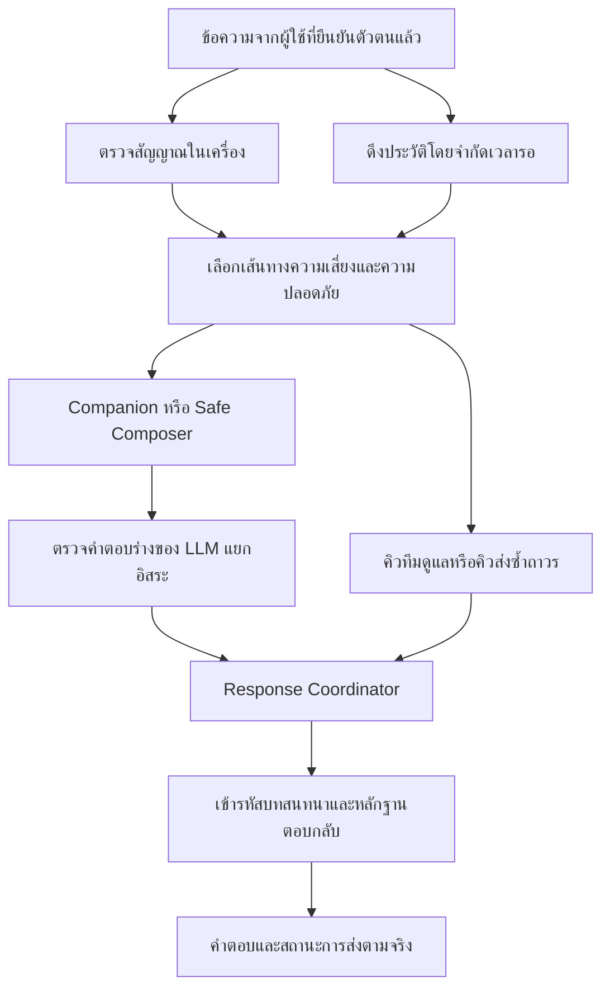

# Hydra Fallback Mesh — ฉบับที่เชื่อมเข้ากับระบบ Demo แล้ว

อัปเดต: 2026-09-15 — พัฒนาต่อจาก `hydra-mesh-v2-mistral-fix-retry.zip`

## หลักการ

> Hydra ลดความสามารถได้ แต่ต้องรักษาความซื่อสัตย์ เส้นทางความปลอดภัยที่ยังใช้งานได้ และความต่อเนื่องในการดูแล

ข้อความแจ้งข้อผิดพลาดทั่วไปต้องไม่กลายเป็นคำตอบหลักของบทสนทนา และต้องแยกให้ชัดว่า **รับคำขอแล้ว**, **บันทึกข้อมูลถาวรแล้ว**, **เข้าคิวให้ทีมดูแลตรวจสอบแล้ว** และ **มีเจ้าหน้าที่รับทราบแล้ว** เป็นคนละเหตุการณ์

## สถาปัตยกรรมที่ลงมือทำแล้ว

- `lib/fallback/safety.ts` — ตรวจสัญญาณเบื้องต้นโดยไม่พึ่งเครือข่าย หากไม่พบสัญญาณให้เป็น `unknown` ไม่ใช่ `none` และยังรักษาสัญญาณอันตรายชัดเจนจากข้อความก่อนหน้าที่เพิ่งเกิดขึ้นไว้เมื่อระบบมีปัญหา
- `lib/security/orchestrator.ts` — Detector และการประเมินความเสี่ยงผ่านโมเดลทำงานแยกกัน เมื่อโมเดลล้มเหลว ข้อมูลสัญญาณที่ตรวจพบในเครื่องยังอยู่ พร้อมทางเลือกเรียก Risk Model จากผู้ให้บริการสำรอง
- `lib/fallback/coordinator.ts` — จัดการความล้มเหลวของ history, routing, review, การสร้างคำตอบ และการบันทึกแยกจากกัน ห้ามปล่อยคำตอบร่างของ LLM ที่ยังไม่ผ่านการตรวจ ส่วน API ยังมีขอบเขตดักความล้มเหลวชั้นสุดท้าย
- `lib/fallback/composer.ts` — เลือกประกอบข้อความจากหัวข้อ อารมณ์ และเจตนาที่พบในข้อความล่าสุด หลีกเลี่ยงคำถามที่เพิ่งใช้ เคารพเมื่อผู้ใช้ไม่อยากเล่า และไม่แทรกข้อความดิบตามใจผู้ใช้ลงในคำตอบ ชุดข้อความเหล่านี้เขียนขึ้นภายใต้ข้อจำกัดของระบบ **ยังไม่ใช่เนื้อหาที่ผ่านการรับรองทางคลินิก**
- `lib/fallback/secondary.ts` — รองรับ Mistral เป็นโมเดลสำรองของ Risk และ Companion โดยตั้งค่าโมเดลแยกตามบทบาท ส่วน Anthropic ยังเป็นผู้ให้บริการหลัก คำตอบร่างของ Companion สำรองยังต้องผ่าน Output Auditor ที่ตรวจแยกจากผู้สร้างคำตอบ
- `lib/fallback/outbox.ts` — คิวพักงานบนพื้นที่จัดเก็บถาวร แยกจากฐานข้อมูลหลักและเข้ารหัสด้วย AES-256-GCM เผยแพร่งานเข้าคิวแบบ atomic ใช้ `fsync` กับไฟล์และไดเรกทอรี ตรวจความถูกต้องของตัวตนงาน และจำกัดจำนวนงานต่อรอบของ worker จึงไม่ต้องดึงกุญแจ DEK ของผู้ป่วยจากฐานข้อมูลในช่วงที่ฐานข้อมูลล่ม
- `lib/fallback/delivery.ts` — พยายามส่งตรงด้วยการเขียนซ้ำที่ไม่สร้างข้อมูลซ้ำ หากยืนยันการส่งตรงไม่ได้จึงเก็บลงคิวถาวรเพื่อส่งซ้ำ ห้ามถือว่าเรียกฟังก์ชันแล้วแปลว่าส่งสำเร็จ
- `lib/client/outbox.ts` — เก็บข้อความและร่างแบบประเมินเป็นข้อมูลเข้ารหัสใน IndexedDB พร้อมกุญแจ AES-GCM ที่ตั้งค่าไม่ให้ส่งออก โดยแยกข้อมูลตามบัญชี
- `lib/useCompanion.ts` — ยืนยันบัญชีก่อนส่ง ใช้รหัสข้อความเดิม แสดงสถานะรอส่ง/รับแล้ว รองรับการส่งซ้ำเมื่อเชื่อมต่อกลับมาหรือกดเอง แยกข้อความสถานะระบบ และเปิดส่วนช่วยเหลือในเครื่องได้เมื่อหน้าแอปโหลดไว้แล้ว

ตัวตรวจสัญญาณในเครื่องเริ่มทำงานก่อนอ่านฐานข้อมูล ส่วนปุ่มช่วยเหลือในเบราว์เซอร์แสดงได้โดยไม่ต้องรอ server การอ่าน history และหลักฐานตอบกลับบน server มีเวลารอสูงสุด หากพบสัญญาณอันตรายปัจจุบันที่ชัดเจน ระบบใช้เส้นทางตอบด้านความปลอดภัยที่จำกัดขอบเขตไว้ โดยไม่รอ Risk Model หรือ Companion ผ่านเครือข่าย ทั้งนี้ไม่ได้ข้ามการตรวจสิทธิ์หรืออนุญาตให้เรียกเครื่องมือที่ไม่ปลอดภัย

## พฤติกรรมของ Fallback แต่ละกรณี

| ระดับหรือสถานการณ์ | พฤติกรรมที่ลงมือทำแล้ว |
|---|---|
| P0 | Companion หลักใช้ประวัติสนทนา และผ่านการตรวจคำตอบแยกอิสระ |
| P1 | เมื่อโมเดลหลักล้มเหลว ใช้ Mistral Companion ที่ตั้งค่าไว้ โดยยังผ่านด่านตรวจคำตอบเดิม |
| P2 | เมื่อเปิดประวัติไม่ได้ ใช้ข้อความล่าสุด พร้อมบอกข้อจำกัดของบริบทอย่างชัดเจน |
| P3 | เมื่อโมเดล, Risk หรือ Auditor ใช้ไม่ได้ ใช้ตัวประกอบคำตอบตามบริบทที่ทำงานด้วยกฎแน่นอน |
| P4 | ในหน้าที่โหลดไว้แล้ว แสดงข้อความรอส่ง ช่องทางช่วยเหลือในเครื่อง และคิวข้อความเข้ารหัส |
| Risk Model ผ่านเครือข่ายใช้ไม่ได้ | ใช้ตัวตรวจสัญญาณในเครื่อง การไม่พบสัญญาณไม่ได้ยืนยันว่าความเสี่ยงต่ำ |
| ฐานข้อมูลคิวทีมดูแลใช้ไม่ได้ | ใช้คิวพักงานเข้ารหัสที่แยกออกมา ให้สถานะ `pending` หลังยืนยัน `fsync` แล้วเท่านั้น |
| บันทึกข้อมูลตามปกติไม่ได้ | เป็น `pending` หากเก็บลงคิวพักได้ หรือ `failed` หากยืนยันการเก็บทั้งสองทางไม่ได้ |
| Auditor ใช้ไม่ได้หรือปฏิเสธคำตอบ | ทิ้งคำตอบร่างของ LLM แล้วใช้ Safe Composer |
| ส่งข้อความเดิมที่ทำเสร็จแล้วซ้ำ | คืนคำตอบจากหลักฐานที่เข้ารหัสไว้ โดยไม่เรียกโมเดลใหม่ |
| ไม่ทราบสถานะองค์ประกอบ | แสดงว่าไม่ทราบ ไม่เปลี่ยนเป็นปกติโดยอัตโนมัติเพียงเพราะไม่มีเหตุการณ์ใหม่ |

การตรวจคำสำคัญในเครื่องเป็นฐานทางวิศวกรรมที่เลือกเผื่อความปลอดภัยไว้ก่อน ยังไม่ใช่ตัวจำแนกที่พิสูจน์แล้วว่าตรวจพบสัญญาณได้ครอบคลุมสูง กรณีคำปฏิเสธ ข้อความอ้างคำพูด อุปมา เรื่องของบุคคลอื่น คำสะกดผิด ภาษาถิ่น และการคลี่คลายวิกฤตหลายรอบสนทนา ยังต้องตรวจสอบร่วมกับผู้เชี่ยวชาญด้านภาษาและคลินิก ระบบส่วนนี้ไม่ได้ทำหน้าที่วินิจฉัยโรค และต้องประเมินทั้งข้อความวิกฤตกับกฎส่งต่อก่อนใช้กับผู้ป่วยจริง

## ข้อตกลงเรื่องความจริงของสถานะส่งต่อ

| สถานะ | หลักฐานที่ต้องมี | ความหมายที่สื่อกับผู้ใช้ |
|---|---|---|
| `not_required` | รอบนี้ไม่มีคำตัดสินให้ส่งตรวจสอบ | ไม่กล่าวอ้างเรื่องการส่งต่อ |
| `pending` | ยืนยันว่าเก็บงานลงคิวพักถาวรแล้ว | เก็บไว้เพื่อส่งซ้ำ แต่ยังไม่ยืนยันว่าเข้าคิวทีมดูแล |
| `queued` | ยืนยันการบันทึกหรืออ่านพบรายการในคิวทีมดูแล | เข้าคิวแล้ว แต่ยังไม่อ้างว่ามีคนเห็น |
| `acknowledged` | รายการตรวจสอบถูกเจ้าหน้าที่กดรับทราบ | เจ้าหน้าที่รับทราบเคสแล้ว |
| `failed` | ยืนยันการส่งตรงหรือเก็บถาวรเพื่อส่งซ้ำไม่ได้ | ยังไม่มีหลักฐานว่าส่งสำเร็จ พร้อมแสดงช่องทางช่วยเหลือโดยตรง |

Prompt ของ Companion ห้ามกล่าวอ้างเรื่องการส่งต่อ โดย server แสดงสถานะแยกต่างหาก ค่า `acknowledged` อ่านจากรายการ Human Review เท่านั้น หมายถึงการรับทราบ ไม่ได้แปลว่าเกิดการรักษา การติดต่อ หรือการตอบสนองทางคลินิกแล้ว รุ่นนี้ยังไม่ได้เพิ่มการแจ้งเตือนผ่าน SMS, อีเมล หรือช่องทางแจ้งแพทย์ภายนอก

## การเก็บข้อมูลและการตอบกลับเมื่อส่งซ้ำ

`messageId` ฝั่ง client ใช้รหัสเดิมและผูกกับผู้ป่วยที่ยืนยันตัวตนแล้ว รหัสของรอบสนทนา รายการส่งตรวจสอบ และหลักฐานตอบกลับ สร้างจากคู่นี้ร่วมกับประเภทข้อมูล ข้อความในรอบสนทนาและหลักฐานตอบกลับที่เข้ารหัสบันทึกพร้อมกันใน transaction เดียว

เมื่อส่งซ้ำ ข้อความต้องตรงกับต้นฉบับในหลักฐานตอบกลับ หากเปลี่ยนข้อความแต่ใช้รหัสเดิม API ตอบ `409` คำขอซ้ำที่ยังประมวลผลอยู่จะเรียงทำงานทีละคำขอภายใน Node process เดียว ส่วนการเขียนคิวทีมดูแลและบทสนทนาใช้ upsert เพื่อไม่สร้างแถวซ้ำเมื่อ worker ล้มหรือส่งงานเดิมอีกครั้ง

คิวพักงานรองรับ **เครื่องแม่ข่ายเดียว (single-host)** บนไดเรกทอรีที่ผูกกับพื้นที่จัดเก็บถาวร ยังไม่ใช่ระบบส่งข้อความข้ามภูมิภาค งานฐานข้อมูลที่หมดเวลารออาจยังทำต่อจนสำเร็จ จึงใช้รหัสเดิมที่คำนวณได้แน่นอนทุกครั้งที่เขียนซ้ำ Worker เก็บงานที่ล้มเหลวหรือเสียหายไว้ และรายงานเฉพาะจำนวนงาน ข้อมูลเข้ารหัสที่ตรวจความถูกต้องไม่ผ่านจะไม่ถูกส่งต่อ

หาก process ล้มระหว่างถือล็อกงาน อาจเหลือไดเรกทอรี `.lock` วิธีฟื้นคืนคือหยุด worker ทุกตัว ยืนยันว่า process เดิมหยุดแล้ว ลบเฉพาะล็อกค้างนั้น แล้วเริ่ม worker ใหม่ ห้ามลบล็อกที่ยังใช้งานอยู่ ต้องติดตามความจุพื้นที่ รหัสจบการทำงานของ worker และจำนวนงานค้างจากระบบภายนอกด้วย

สถานะรับข้อความในเบราว์เซอร์ (`received`) ต่างจากการบันทึกถาวรในฐานข้อมูล หากบันทึกถาวรไม่สำเร็จ ข้อความในเครื่องยังรอส่ง และ metadata ของคำตอบแยกสถานะการเก็บข้อมูลไว้ต่างหาก

กุญแจในเบราว์เซอร์ช่วยป้องกันข้อมูลที่เก็บอยู่ แต่ไม่ได้ป้องกันกรณีเว็บไซต์ถูกโจมตีด้วย XSS ผู้ดูแลอุปกรณ์เข้าถึงเครื่อง หรือบัญชีถูกเปิดใช้งานค้างไว้ หลังโหลดหน้าใหม่ต้องยืนยันบัญชีสำเร็จก่อนเปิดร่างที่เก็บไว้ รุ่นนี้ยังไม่มี service worker หรือส่วนแอปสำหรับเริ่มเปิดใหม่ขณะออฟไลน์ทั้งหมด การช่วยเหลือในเครื่องจึงต้องอาศัยหน้าที่โหลดไว้แล้ว และห้ามอ้างว่า server รับข้อความในช่วงที่ยังส่งไปไม่ถึง

## แบบประเมินและหน้าจอแพทย์

- คำตอบ 9Q/8Q และขั้นตอนปัจจุบันเก็บเป็นร่างเข้ารหัสในเครื่อง โดยรอให้การแก้ไขหยุด 200 มิลลิวินาทีก่อนบันทึก (debounce)
- การส่งซ้ำใช้รหัสการส่งเดิมจนกว่าจะมีการเปลี่ยนคำตอบ การเขียนแบบประเมินบน server ไม่สร้างข้อมูลซ้ำ และใช้คิวพักแยกเมื่อเก็บโดยตรงไม่ได้
- สัญญาณชัดเจนจากคำตอบ 8Q เข้าสู่เส้นทางตรวจสอบได้โดยไม่รอการบันทึกคะแนนรวม สูตรคะแนนและเกณฑ์คะแนนส่งต่อด่วน `>=17` เดิมยังคงเดิม กฎสัญญาณรายข้อเป็นคำขอให้ตรวจสอบเพิ่มเติม ไม่ใช่การวินิจฉัยหรือการยืนยันว่ามีอันตรายฉุกเฉินในขณะนี้ และยังต้องผ่านการตรวจทางคลินิก
- ปุ่มช่วยเหลือในเบราว์เซอร์สำหรับสัญญาณเรื่องแผน การเตรียมการ การพยายามทำร้ายตนเอง หรือการควบคุมความคิด แสดงได้โดยไม่รอส่งแบบประเมิน หากตัดการเชื่อมต่อทั้งหมด ปุ่มเหล่านี้ไม่สามารถแจ้งแพทย์ได้ จึงเสนอช่องทางติดต่อโดยตรง
- หน้าทำแบบประเมินเสร็จแสดงคำขอบคุณและสถานะการเก็บข้อมูล/ส่งต่อตามจริง ไม่สัญญาว่าแพทย์จะติดต่อกลับ และไม่แสดงป้ายระดับความรุนแรงให้ผู้ป่วย
- หน้าจอแพทย์แสดงสถานะแยกตามองค์ประกอบ พร้อมเวลาและขอบเขตว่าเป็นข้อมูลของ process นี้ หากรีเฟรชล้มเหลวยังเก็บข้อมูลที่แสดงไว้ พร้อมป้ายว่าอาจไม่ล่าสุด ไม่ถือว่าไม่มีข้อผิดพลาดแปลว่าระบบปกติ รายชื่อผู้ป่วยดึงจากฐานข้อมูลและจำกัดตาม `CareAssignment` แล้ว ไม่ใช้ mock
- หากโมเดลสรุปใช้ไม่ได้ แสดงบทสนทนาต้นทางและตารางคะแนน หากเปิดข้อมูลคลินิกต้นทางไม่ได้ ให้แสดงว่าใช้งานไม่ได้ ไม่สร้างสรุปขึ้นเองหรือแสดงเป็นความเสี่ยงต่ำ
- การกำหนดแพทย์ประจำผู้ป่วยและ capability สำหรับข้อมูลคลินิกเพิ่มใน milestone 2026-09-16 แล้ว ดู `docs/CLINICIAN_AUTHORIZATION.md` ส่วนการติดตามสถานะทุกเครื่อง นโยบายเข้าถึงข้อมูลออฟไลน์ร่วมกัน วงจรกุญแจบนอุปกรณ์ การแจ้งเตือน และการย้อนคืนค่าตั้งค่าภายใต้การกำกับ ยังเป็นงานสำหรับการนำขึ้นใช้งาน

## วิธีติดตั้งและอัปเกรด

ใช้ Node 20 ขึ้นไป โดยรอบนี้ทดสอบกับ Node 24 เก็บรักษาข้อมูลผู้ป่วยและกุญแจเดิมไว้

1. รัน `npm ci`
2. คัดลอก `.env.example` เป็น `.env` แล้วตั้งค่าความลับของแอปตามระบบเดิม
3. สำรองฐานข้อมูลปัจจุบัน จากนั้นรัน `npx prisma db push` เพื่อเพิ่ม `CompanionReceipt`, `CareAssignment` และหลักฐานผู้รับทราบคิว รุ่นนี้ไม่จำเป็นต้องลบตารางเดิม
4. ตั้ง `HYDRA_OUTBOX_DIR` เป็นพาธเต็มของไดเรกทอรีบนพื้นที่จัดเก็บถาวรที่เข้าถึงได้เฉพาะเจ้าของ ตั้ง `HYDRA_OUTBOX_KEY` เป็นกุญแจสุ่มเฉพาะงานนี้ ขนาด 32 ไบต์ในรูปเลขฐานสิบหก สร้างได้ด้วย `openssl rand -hex 32` และสำรองกุญแจอย่างปลอดภัยควบคู่กับคิวเข้ารหัส หากเว้นว่างหรือตั้งค่าผิด ระบบจะแจ้งว่าการเก็บเพื่อส่งซ้ำล้มเหลว ไม่อ้างว่าเก็บถาวรได้แล้ว
5. หากต้องการโมเดลสำรอง ตั้ง `HYDRA_RISK_SECONDARY_MODEL` และ/หรือ `HYDRA_COMPANION_SECONDARY_MODEL` เป็นรหัสโมเดลที่ประเมินแล้วและได้รับอนุญาตให้ส่งข้อมูลประเภทนี้ไป ทั้งสองบทบาทใช้ `MISTRAL_API_KEY` เดิม หากเว้นว่างจะปิดการใช้โมเดลสำรองของบทบาทนั้น
6. รัน `npm run typecheck`, `npm run test:fallback`, `npm run test:fallback-storage`, `npm run test:fallback-integration` และ `npm run test:clinician-authorization` จากนั้นรัน `npm run build` และ `npm start`
7. ตั้งให้ `npm run outbox:retry` ทำงานเป็นระยะผ่าน supervisor หรือ cron ของระบบที่นำขึ้นใช้งาน โดยใช้ฐานข้อมูล กุญแจ และพื้นที่จัดเก็บชุดเดียวกัน คำสั่งรายงานจำนวนงานและคืนรหัสจบที่ไม่ใช่ศูนย์เมื่อมีงานล้มเหลว มีคำสั่ง worker ให้แล้ว แต่ยังไม่ได้ติดตั้งตัวตั้งเวลาบนระบบภายนอก

ชุดทดสอบ integration ใหม่สร้างและลบฐานข้อมูล SQLite ชั่วคราวเอง ใช้ข้อมูลจำลองและจำลองการตอบ HTTP ของผู้ให้บริการ ไม่ต้องใช้ข้อมูลรับรองจริง **ห้ามเปลี่ยนให้ชุดทดสอบนี้ใช้ฐานข้อมูล production**

## ผลการตรวจสอบที่ทำแล้วในรอบพัฒนา

- การตรวจแกนระบบ 52 checks รวมความล้มเหลว 32 รูปแบบที่ผสมกันระหว่าง history, routing, การสร้างคำตอบ, การบันทึก และ observer ครอบคลุมคำตอบทั่วไปตามบริบท การรักษาสัญญาณวิกฤต สถานะไม่ทราบเมื่อไม่พบสัญญาณ การปฏิเสธผล Risk ที่ผิดรูปแบบ และการไม่ปล่อยคำตอบที่ยังไม่ผ่านการตรวจ
- ทดสอบเขียนและอ่านคิวพักเข้ารหัส การส่งงานเดียวกันพร้อมกัน การเก็บงานเมื่อส่งไม่สำเร็จ การส่งซ้ำ ข้อมูลขัดแย้งภายใต้รหัสเดียวกัน และการปฏิเสธข้อมูลที่ authentication tag ถูกแก้ไข
- ทดสอบเข้ารหัส/ถอดรหัสใน IndexedDB การแยกบัญชี รหัสซ้ำ และการลบ ด้วย fake-indexeddb ยังไม่ใช่การทดสอบบนเบราว์เซอร์ Android จริง
- ทดสอบ API handler กับ SQLite จริง ครอบคลุมสิทธิ์เข้าใช้งาน คำตอบหลัก การคืนคำตอบเดิม รหัสข้อความขัดแย้ง คำขอซ้ำพร้อมกัน ผู้ให้บริการสำรอง Auditor ล่ม history ล่ม คิวล่มและส่งซ้ำ การรับทราบโดยมนุษย์ การปฏิเสธเมื่อสลับบัญชี การส่งตรวจจากสัญญาณแบบประเมินและป้องกันข้อมูลซ้ำ รวมถึงการแสดงข้อมูลต้นทางเมื่อสรุปสำหรับแพทย์ไม่ได้
- ทดสอบ patient-scoped authorization ด้วยแพทย์สองคน ผู้ป่วยสองคน staff/admin/security ครอบคลุมรายชื่อ สรุป คิว การรับทราบ การมอบหมาย การยกเลิก และการปฏิเสธการเปิดข้ามเคส
- ชุดทดสอบเดิมด้านคะแนนแบบประเมินและ audit/circuit breaker/capability ผ่าน
- การตรวจชนิดข้อมูลและการคอมไพล์ Next แบบ production ผ่าน

**สิ่งที่ยังไม่ได้ตรวจในรอบนี้:** การใช้งานได้จริงของผู้ให้บริการและรหัสโมเดล คุณภาพทางคลินิกจริง วงจรแอป Android และการส่งซ้ำเบื้องหลัง การแจ้งแพทย์จริง การสลับระบบข้ามเครื่อง การกู้คืนหลังไฟดับบนพื้นที่จัดเก็บที่จะนำไปใช้ การเข้าถึงสำหรับผู้ใช้ที่มีข้อจำกัด และการตรวจหน้าตาในเบราว์เซอร์

สถานะรุ่นนี้คือโค้ดที่เชื่อมเข้ากับ Demo และทำงานผ่านการทดสอบตามรายการข้างต้น ยังไม่ใช่การรับรองว่าพร้อมใช้งานทางคลินิกโดยไม่มีผู้กำกับดูแล

## แหล่งข้อมูลสำหรับข้อเท็จจริงด้านความปลอดภัย

ตรวจข้อมูลช่องทางติดต่อเมื่อ 2026-09-15:

- [กรมสุขภาพจิต — Mental Health Check-In](https://checkin.dmh.go.th/) — สายด่วน 1323 ตลอด 24 ชั่วโมง
- [สถาบันการแพทย์ฉุกเฉินแห่งชาติ](https://www.niems.go.th/contact) — หมายเลข 1669

แหล่งข้อมูลเหล่านี้ยืนยันข้อเท็จจริงของช่องทางติดต่อ ไม่ได้เป็นการรับรองตัวตรวจสัญญาณหรือเกณฑ์ทางคลินิกของ Hydra ต้องรักษาความแตกต่างระหว่างข้อเท็จจริงด้านความปลอดภัยที่แน่นอน กับบทสนทนาที่ปรับตามบริบท
